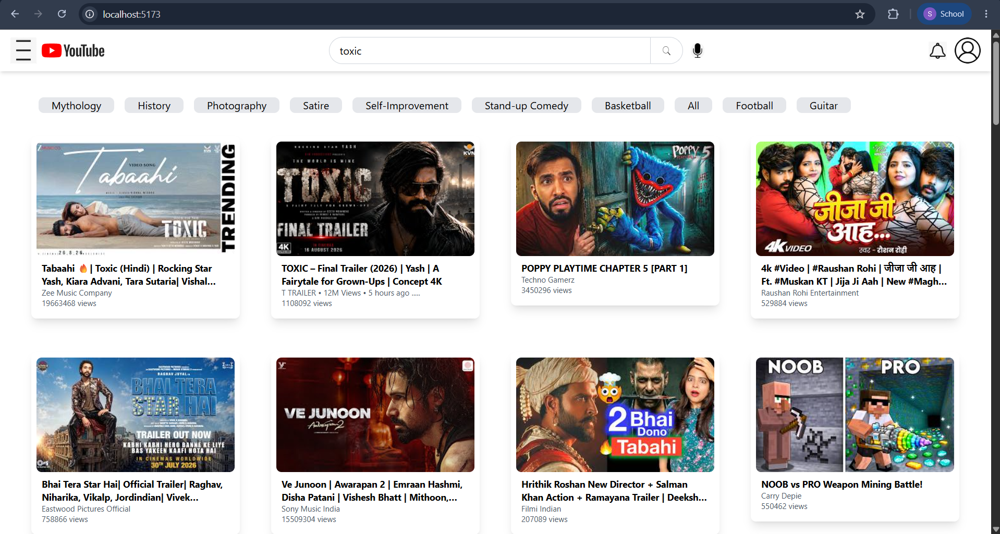
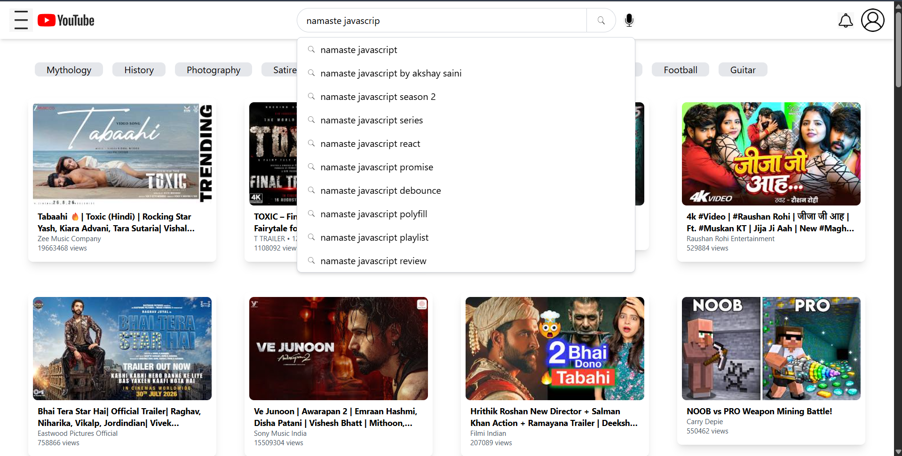
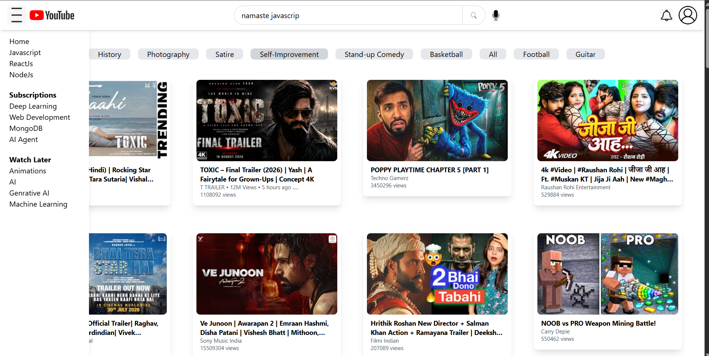

# My YouTube App

A modern YouTube-inspired web application built with **React**, **Vite**, **Redux Toolkit**, and **Tailwind CSS**. The project recreates the core YouTube interface, allowing users to browse videos, search content, watch videos, and experience a responsive UI.

---

## Features

- 🏠 Home page with video feed
- 🔍 Search functionality
- ▶️ Watch video page
- 📂 Responsive sidebar navigation
- 💬 Live chat component
- 💭 Nested comments section
- ⚡ Fast development with Vite
- 📱 Responsive design

---

## Tech Stack

- React 19
- Vite
- Redux Toolkit
- React Router
- Tailwind CSS
- JavaScript (ES6+)

---

## Project Structure

```
src/
├── components/
├── assets/
├── App.jsx
├── main.jsx
└── ...
```

---

## Getting Started

### Clone the repository

```bash
git clone https://github.com/<your-github-username>/myyoutubeapp.git
```

### Navigate to the project

```bash
cd myyoutubeapp
```

### Install dependencies

```bash
npm install
```

### Start the development server

```bash
npm run dev
```

The application will be available at:

```
http://localhost:5173
```

---

## Build for Production

```bash
npm run build
```

Preview the production build:

```bash
npm run preview
```

---

## Screenshots
### Home Page



### Search Bar



### Side Bar




---

## Future Improvements

- User authentication
- YouTube Data API integration
- Video upload functionality
- Dark mode
- Infinite scrolling
- Like & Subscribe features

---

## Contributing

Contributions, issues, and feature requests are welcome.

---

## License

This project is created for learning and educational purposes.

---

 If you found this project helpful, consider giving it a star!
